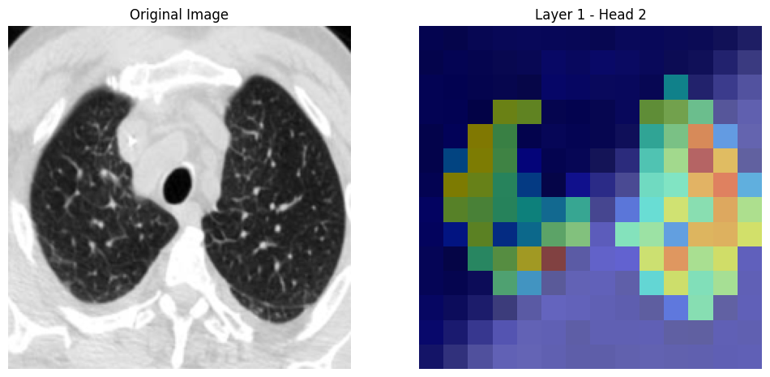

# VIT classifier

## Описание проекта

Проект является учебным и направлен на создание классификтора VIT с помощью фреймворка PyTorch.
В качестве используемого датасета, было выбрано Kaggle соревнование:

(https://www.kaggle.com/datasets/plameneduardo/sarscov2-ctscan-dataset/data)


## Описание датасета

Общедоступный датасет КТ-сканов легких для обнаружения инфекции SARS-CoV-2 (COVID-19), содержащий 1252 КТ-скана, положительных на инфекцию SARS-CoV-2, и 1230 КТ-сканов пациентов, не инфицированных SARS-CoV-2, всего 2482 КТ-скана. Эти данные были собраны у реальных пациентов в больницах Сан-Паулу, Бразилия. Цель этого датасета - способствовать исследованию и разработке методов искусственного интеллекта, которые могут определить, инфицирован ли человек SARS-CoV-2, анализируя его/ее КТ-сканы.


### Постановка задачи

Разработать и оптимизировать модель VIT, способную классифицировать КТ-сканы легких как положительные или отрицательные на наличие инфекции SARS-CoV-2 (COVID-19) с использованием датасета КТ-сканов.

Пример избражения из исходного датасета:

#### Covid


#### Non-Covid


## Структура проекта

Структура проекта

### 1. Загрузка изображений, нарезка изображений на патчи

Пример нарезки изображения на патчи размером 7 на 7


### 2. Создание простой архитектуры TransformerClassifier

Созданная модель будет содержать 2 механизма SelfAttention. И будет обучена на трансформере содержащем 2 головы. Изображения будут подаваться нарезанными на патчи размером 32x32

Таким образом уже на 10й эпохе получаем следующие метрики:

- Train Loss   : 0.4855
- Val Loss     : 0.4867
- Val Accuracy : 0.7847


График обучения модели:


Тогда, мы получаем следующую визуализацию механизма attention (1й слой, 1ая голова)


Архитектура рассматриваемой модели будет выглядеть так:

```plaintext
TransformerClassifier(
  (embeddings): Conv2d(1, 64, kernel_size=(32, 32), stride=(32, 32))
  (attention1): SelfAttention(
    (query): Linear(in_features=64, out_features=64, bias=True)
    (key): Linear(in_features=64, out_features=64, bias=True)
    (value): Linear(in_features=64, out_features=64, bias=True)
    (fc_out): Linear(in_features=64, out_features=64, bias=True)
  )
  (attention2): SelfAttention(
    (query): Linear(in_features=64, out_features=64, bias=True)
    (key): Linear(in_features=64, out_features=64, bias=True)
    (value): Linear(in_features=64, out_features=64, bias=True)
    (fc_out): Linear(in_features=64, out_features=64, bias=True)
  )
  (fc): Linear(in_features=64, out_features=2, bias=True)
)

```

### 3. Подбор параметров модели

Добавим в модель DropOut и ещё один слой SelfAttention. Попробуем подобрать подходящие гиперпараметры для получившейся архитектуры.

##### Перебор гиперпараметров

Определение параметров для перебора

patch_sizes = [8, 16, 32]
num_heads = [1, 2, 4]
dropout_probs = [0.1, 0.3, 0.5]

#### Оптимальные параметры

В результате самыми оптимальными параметрами будут являться:

Best Validation Accuracy: 0.8270 for model with parameters: (16, 4, 0.3)


#### Визуализация подбора параметров

Приведу несколько графиков получившихся в результате перебора параметров

- patch_sizes   = 16
- num_heads     = 4
- dropout_probs = 0.1


- patch_sizes   = 16
- num_heads     = 4
- dropout_probs = 0.3


- patch_sizes   = 16
- num_heads     = 4
- dropout_probs = 0.5


3. Обучение выбранной модели
Получив парметры которые дают наиболее точные результаты для моделей. Попробуем обучить модель с применением большего колличества слоёв self attention, так же попробуюем визуализировать карты внимания для обученной нами модели

Таким образом мы получим следующие метрики 

**Train Loss: 0.4179, Val Loss: 0.3759, Val Accuracy: 0.8169**

График обучения модели


### Карты внимания для модели





## Полученные результаты

Для выбранной нами модели, нами были получены следующие метрики:

Accuracy  : 0.8169
Precision : 0.8267
Recall    : 0.8169
MCC       : 0.6436


## Использованные библиотеки
Проект использует следующие библиотеки:

- random: для генерации случайных чисел и задания начальных параметров.
- numpy: для работы с массивами и математическими операциями.
- pandas: для обработки и анализа данных.
- matplotlib: для 2D визуализации данных.
- seaborn: для улучшенной визуализации данных на основе matplotlib.
- torch: для построения и обучения нейронных сетей.
- torchvision: для загрузки и предобработки данных изображений.
- torchsummary: для визуализации структуры нейронных сетей.
- sklearn: для расчета метрик классификации.


## Структура репозитория
- **transformer_classifier.ipynb**: Jupyter Notebook с кодом, реализующим VIT классификатор.
- **test_model.ipynb**: Jupyter Notebook с примером использования сохранённой модели на изображения их интернета.
- **classifier_model**: Сохранённая модель классификатора.
- **requirements.txt**: Файл со списком зависимостей, необходимых для запуска кода.


## Как использовать проект
1. Склонируйте репозиторий на свой компьютер.
2. Установите необходимые зависимости, указанные в файле `requirements.txt`.
3. Запустите Jupyter notebook `test_model.ipynb`, следуя инструкции в нём.
4. В качестве используемой модели выберите сохранённую модель `classifier_model.txt`.
5. В поле `image_url` скопируйте URL-ссылку на интересующее изображение.


## Контактная информация
Если у вас есть вопросы или предложения по улучшению проекта, свяжитесь со мной:
- Email: maximgoltsov@gmail.com
